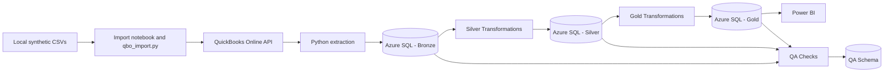

# Sample FP&A Analytics Pipeline

End-to-end FP&A analytics portfolio project that extracts accounting data from **QuickBooks Online**, processes it through a **Bronze / Silver / Gold** data architecture in **Azure SQL**, applies automated **data quality checks**, and prepares curated datasets for consumption in **Power BI**.

> This project uses synthetic business data and a QuickBooks Online sandbox environment. No real company or customer data is included.

## Architecture



The pipeline is currently orchestrated locally through Python/Jupyter notebooks, keeping the project lightweight while still demonstrating production-style analytics engineering patterns.

## Business Scenario

CloudFlow Systems, Inc. is a fictional B2B SaaS company used to simulate a realistic FP&A environment.

The accounting history covers **September 2023 through August 2026** and supports analysis such as revenue and expense trends, monthly P&L reporting, Actual performance by account, budget and forecast integration, SaaS metrics, and headcount analysis.

The current version focuses on the accounting Actuals pipeline.

## Tech Stack

- **QuickBooks Online API** — accounting source system
- **Python** — extraction, transformation, orchestration, and QA
- **Pandas** — data transformation
- **SQLAlchemy + pyodbc** — Azure SQL connectivity
- **Azure SQL Database** — cloud data storage
- **Jupyter / VS Code** — development and pipeline execution
- **Power BI** — semantic modeling and reporting

## Data Architecture

### Bronze

Raw API responses are stored with minimal transformation.

```text
bronze.qbo_accounts_raw
bronze.qbo_customers_raw
bronze.qbo_journal_entries_raw
```

Each record includes source entity ID, batch ID, extraction timestamp, and the original JSON payload.

### Silver

The Silver layer converts raw JSON payloads into structured analytical tables.

```text
silver.dim_account
silver.dim_customer
silver.fact_gl
```

Key transformations include parsing QuickBooks JSON, standardizing data types, creating signed debit/credit amounts, adding time attributes, and filtering sandbox sample transactions.

### Gold

The Gold layer contains datasets designed for BI consumption.

```text
gold.pnl_monthly_actual
```

The current P&L table aggregates Actuals by year, month, account, account type, account subtype, and accounting classification.

Revenue and expense signs are normalized for reporting.

## Data Quality

Pipeline checks are stored in:

```text
qa.pipeline_checks
```

Current checks include:

- Bronze datasets are not empty
- Required Silver fields are not null
- Journal line IDs are unique
- Journal entries are balanced
- Expected number of CloudFlow journals
- Expected number of reporting months
- Gold output is not empty

Critical failures can stop the pipeline before downstream consumption.

## Project Structure

```text
quickbooks-pipeline/
|-- notebooks/
|   |-- 00_setup_and_connections.ipynb
|   |-- 00_import_quickbooks.ipynb
|   |-- 01_extract_quickbooks_bronze.ipynb
|   |-- 02_transform_silver.ipynb
|   |-- 03_build_gold.ipynb
|   |-- 05_import_budget_forecast.ipynb
|   |-- 04_qa_checks.ipynb
|   |-- 99_run_pipeline.ipynb
|   `-- 99_reset_qbo_sandbox.ipynb
|-- src/
|   |-- __init__.py
|   |-- config.py
|   |-- quickbooks.py
|   |-- qbo_import.py
|   |-- planning.py
|   |-- qbo_cleanup.py
|   |-- azure_sql.py
|   |-- transformations.py
|   `-- qa.py
|-- tests/
|   `-- test_qbo_import.py
|-- Data/                      # Local input files; excluded from Git
|-- tokens/                    # Local OAuth token; excluded from Git
|   `-- qbo_tokens.json
|-- .venv/                     # Local Python environment
|-- .env                       # Local connection settings and secrets
|-- .gitignore
`-- README.md
```

### Why the code is separated

Notebooks provide the interactive entry points: choose settings, execute stages,
and inspect tables and results. The `src/` modules implement reusable functions
so the same logic can be used by individual notebooks, the full pipeline, and
automated tests. Python execution files in `notebooks/` use `.ipynb`; reusable
modules in `src/` use `.py`.

| Module | Responsibility |
|---|---|
| `config.py` | Load `.env`, define project paths and API/database settings, and validate pipeline configuration. |
| `quickbooks.py` | Refresh OAuth credentials and extract QuickBooks accounts, customers, and journals. |
| `qbo_import.py` | Validate source CSVs, build API payloads, resolve references, and create missing QuickBooks records. |
| `qbo_cleanup.py` | Delete sandbox transactions for a reset; run separately from normal imports and refreshes. |
| `azure_sql.py` | Connect to Azure SQL and provide database read/write helpers. |
| `transformations.py` | Build Bronze payload rows and transform accounting data into Silver tables. |
| `qa.py` | Evaluate data quality during a pipeline run and record results. |

Bronze, Silver, and Gold are Azure SQL data layers, not source-code folders.
`Data/` contains the synthetic inputs used to seed the sandbox and support the
portfolio. `tests/` checks code behavior with simulated API responses; this is
separate from `src/qa.py`, which checks the actual datasets during execution.

## Pipeline Execution

### Import source CSVs into QuickBooks

`notebooks/00_import_quickbooks.ipynb` seeds the configured QuickBooks sandbox
before the extraction notebooks run. Reusable logic lives in `src/qbo_import.py`
and reuses the existing configuration and rotating OAuth token. Azure SQL
credentials are not required for this step.

Open the notebook in Jupyter or VS Code from the project root or `notebooks/`
folder and run the cells in order. Set `APPLY_IMPORT = False` to validate and
preview without API calls. The currently saved notebook has `APPLY_IMPORT = True`;
check this setting before running all cells. To import, use `True`, rerun the
configuration cell, and run the execution cell.

The configuration cell selects the inputs explicitly:

```python
DATA_DIR = PROJECT_ROOT / "Data"
ACCOUNT_FILE = "qbo_chart_of_accounts.csv"
CUSTOMER_FILE = "customer_master.csv"
JOURNAL_FILES = [
    "qbo_journal_import_part1.csv",
    "qbo_journal_import_part2.csv",
]
APPLY_IMPORT = False  # Use True to create records in the sandbox.
```

The notebook locates the project, imports the helper functions, loads and
validates the files, and displays counts and sample payloads. Its execution cell
reloads the inputs before importing. On success, it summarizes records as
`created` or `reused`, with QBO IDs available in `import_results`.

Set `DATA_DIR` in the notebook to choose another folder. The notebook explicitly
selects `qbo_chart_of_accounts.csv`, `customer_master.csv`, `qbo_journal_import_part1.csv`, and
`qbo_journal_import_part2.csv`, using the existing `Data/` column headers.
These files contain 46 accounts, 1,068 customers, and 36 journals (1,577 lines).
Set `CUSTOMER_FILE = None` in the notebook to skip customer import.

Accounts are created first, then customers, then journals with resolved QBO IDs.
Customer_ID maps to DisplayName; all populated source attributes are preserved
in Notes. QBO assigns its own internal customer Id. MRR, seats, segment, tier,
region, and dates remain descriptive notes; they do not create transactions.
Churn_Date does not deactivate a customer.
CSV detail-type labels are mapped to US
API enums. The two Other Expense accounts use OtherMiscellaneousExpense to
preserve their source account classification. Review DETAIL_TYPES for other
company locales. Nonempty TaxCode, Location, and Class are rejected until their
reference mappings are implemented. A nonempty journal Name must match a
Customer_ID in the selected customer file.

The importer validates all files before connecting, checks existing records
before creating anything, and skips matching records. Existing accounts with no
account number (such as sandbox Checking) can be reused without modification.
Inactive records, duplicate identities, and conflicting payloads stop the run.
Existing journal comparison includes date, memo, and ordered lines. Nothing is
updated or deleted. Imports are not atomic: successful records remain if a later
request fails. Rerun the same inputs to resume; do not run concurrent imports.
Stable request IDs protect retries of identical create requests, following
[Intuit's API guidance](https://blogs.a.intuit.com/2018/09/10/quickbooks-online-api-best-practices/).
After resetting the sandbox, use a fresh company if QuickBooks still replays old
request IDs. API acceptance of locale-specific account types is checked by QBO
during the actual import, not by offline validation.

### How the import code works

The [import notebook](notebooks/00_import_quickbooks.ipynb) calls functions in
[`src/qbo_import.py`](src/qbo_import.py):

| Function or class | What it does |
|---|---|
| `read_csv()` | Reads UTF-8 CSVs (including a BOM), trims values, and rejects missing columns, malformed rows, and empty files. |
| `validate_unique()` | Rejects blank or repeated account names, account numbers, and customer display names; comparisons ignore case. |
| `money()` | Uses `Decimal` to reject negative, non-finite, or more-than-two-decimal-place amounts. |
| `load_import_data()` | Builds Account, Customer, and JournalEntry payloads; validates journal balances and references before any API call. Customer loading is enabled by the notebook's explicit `customer_file` argument. |
| `QBOClient` | Reuses OAuth token refresh, maintains an HTTP session, queries records in pages of 1,000, and creates entities with stable request IDs. |
| `find_existing()` / `matches()` | Find existing identities and compare supplied fields while ignoring fields generated by QBO. |
| `import_records()` | Checks remote records for conflicts, creates accounts and customers first, replaces journal name references with QBO IDs, and creates missing journals. |

`QBOClient` is restricted to the configured sandbox URL. It refreshes credentials
on HTTP 401 and makes up to four attempts for connection errors, timeouts,
HTTP 429, and server errors. Create requests reuse a deterministic request ID
based on the company URL, entity, and payload. Exhausted retries and API faults
stop execution rather than silently skipping records.

### CSV-to-API mappings

The input files use the project's CSV layout. The importer converts them into
JSON objects expected by the QuickBooks API.

| Input | CSV fields | Resulting API fields |
|---|---|---|
| Chart of Accounts | `Account Name`, `Account Number`, `Type`, `Detail Type` | `Name`, `AcctNum`, `AccountType`, mapped `AccountSubType` |
| Customers | `Customer_ID` | `DisplayName`; QBO generates its own internal `Id` |
| Customers | All populated source columns | A semicolon-separated string in `Notes` |
| Journals | `*JournalNo`, `*JournalDate`, `Memo` | `DocNumber`, ISO `TxnDate`, `PrivateNote` |
| Journal lines | `*AccountName`, `Debits`, `Credits`, `Description` | Resolved `AccountRef`, `Amount`, `PostingType`, and line `Description` |
| Journal lines | Optional `Name` | Customer `EntityRef` resolved from the selected customer file |

Journal rows are grouped by journal number within each file. Dates must use
`M/D/YYYY`; every journal must have a consistent date and memo, at least two
lines, and equal debit and credit totals. Each line must contain exactly one
positive debit or credit. A journal number appearing in both selected files is
rejected. Only explicitly selected files are read.

`customer_master.csv` has no names, emails, or postal addresses. Its synthetic
IDs therefore appear as customer names in QBO. Subscription metrics remain
text in Notes, not native subscription fields, invoices, or revenue postings.
If customer import is disabled, journal `Name` values must be blank.

### Importer tests

Run from the project root with the project environment active:

```powershell
python -m unittest discover -s tests -v
```

[`tests/test_qbo_import.py`](tests/test_qbo_import.py) uses a fake client to check
creation order, reference resolution, reruns, conflict blocking before writes,
and resuming after a partial import. It also checks invalid monetary values and
paginated reads including inactive master records. These tests do not call QBO
and do not prove live API acceptance of a payload.

### Run the analytics pipeline

Importing seeds QuickBooks; extraction then brings those records into Azure SQL.
`99_run_pipeline.ipynb` runs the analytics refresh and does not invoke the CSV
import or sandbox cleanup.

Individual notebooks can be used during development:

```text
00 → Validate environment and connections
01 → Extract QuickBooks data to Bronze
02 → Transform Bronze to Silver
03 → Build Gold reporting tables
04 → Run and persist QA checks
```

For a full refresh, run:

```text
99_run_pipeline.ipynb
```

## Local Setup

Create and activate a virtual environment:

```powershell
python -m venv .venv
.\.venv\Scripts\Activate.ps1
```

Install the required packages:

```powershell
pip install pandas requests python-dotenv sqlalchemy pyodbc jupyter ipykernel
```

Microsoft **ODBC Driver 18 for SQL Server** must also be installed locally for
the Azure SQL stages.

To register a recognizable Jupyter kernel for this environment:

```powershell
python -m ipykernel install --user --name quickbooks-pipeline --display-name "Python (quickbooks-pipeline)"
```

In VS Code, select **Python (quickbooks-pipeline)** in the notebook kernel picker.
If VS Code remains stuck connecting, use **Developer: Reload Window**, then
select the kernel again. Kernel startup is separate from CSV validation and
QuickBooks API execution.

Create a `.env` file in the project root:

```env
QBO_CLIENT_ID=your_client_id
QBO_CLIENT_SECRET=your_client_secret
QBO_REALM_ID=your_realm_id

AZURE_SQL_SERVER=your_server.database.windows.net
AZURE_SQL_DATABASE=your_database
AZURE_SQL_USERNAME=your_username
AZURE_SQL_PASSWORD=your_password
```

Create:

```text
tokens/qbo_tokens.json
```

with:

```json
{
  "refresh_token": "your_refresh_token"
}
```

The QuickBooks refresh token is rotated automatically by the pipeline.

## Security

Secrets are intentionally excluded from version control.

The repository `.gitignore` should include:

```gitignore
.env
tokens/
.venv/
__pycache__/
*.pyc
.ipynb_checkpoints/
.vscode/
```

Never commit QuickBooks credentials, refresh tokens, or Azure SQL passwords.

## Current Status

Completed:

- CSV-to-QuickBooks import notebook for accounts, customers, and journal entries
- Import validation, conflict detection, retry handling, and isolated tests
- QuickBooks OAuth integration
- QuickBooks API extraction
- Azure SQL connectivity
- Bronze raw ingestion
- Silver accounting model
- Gold monthly P&L Actuals
- Automated QA framework
- End-to-end pipeline notebook


## Azure SQL reset notebook

[`notebooks/99_reset_azure_sql.ipynb`](notebooks/99_reset_azure_sql.ipynb) uses
[`src/azure_sql_cleanup.py`](src/azure_sql_cleanup.py) and the existing Azure SQL
connection settings to preview and drop all user tables and custom schemas in
the configured database, including user tables in `dbo`. Built-in schemas and
the database remain. This is separate from the QuickBooks sandbox reset.

Run the setup and read-only preview cells first. To execute, set
`APPLY_CLEANUP = True`, enter the preview's exact database name in
`CONFIRM_DATABASE`, rerun the settings cell, then run the execution cell.
The saved notebook defaults to preview-only. CONTROL permission on the database
is required. Stop concurrent pipeline runs before executing.

The helper removes foreign keys, handles temporal system versioning, and drops
tables before custom schemas. Other schema objects and special table types are
reported as blockers. It rechecks the reviewed plan and executes in a transaction;
errors roll back, and remaining tables/schemas are checked before committing.
Successful execution removes table data and definitions. Run the analytics
pipeline afterward to rebuild its tables and schemas.


## FP&A budget and rolling forecast imports

[`notebooks/05_import_budget_forecast.ipynb`](notebooks/05_import_budget_forecast.ipynb)
loads `Data/budget_detail.csv` and `Data/forecast_detail.csv` through
[`src/planning.py`](src/planning.py). Run the Actuals pipeline first; the importer
requires `silver.dim_account` and `gold.pnl_monthly_actual`. It does not modify
QuickBooks or the existing Actuals tables.

The supplied CSVs each contain 1,620 rows across 36 months and 45 accounts. The
notebook assumes a September fiscal start, labeling budgets FY2024, FY2025, and
FY2026 by ending year. Configure `FISCAL_START_MONTH` and `BUDGET_LABEL` to match
the approved FP&A calendar and revision. The forecast keeps its source version
`2026-04 Latest Forecast`; `FORECAST_AS_OF` explicitly assigns April 30, 2026.
Its 1,440 Actualized rows cover September 2023-April 2026, and 180 Forecast rows
cover May-August 2026. Future snapshots require a new version name and as-of
mapping. The as-of month is treated as the last actualized month.

### Run the notebook

1. Run setup and configuration; `APPLY_IMPORT = False` is the saved default.
2. Validate the CSVs and inspect totals by scenario, version, and Basis.
3. Run the read-only Azure SQL account-mapping preview and inspect the target.
4. Set `APPLY_IMPORT = True`, rerun configuration, and run the import cell.
5. Review the committed reconciliation summary and refresh Power BI.

Both files load in one transaction. Versions present in the files are replaced
in full; versions absent from the files are retained. Supply complete snapshots,
not incremental patches. Identical reruns do not duplicate records. New budget
labels or forecast version names retain separate revisions. The loader serializes
plan imports and verifies row counts and reporting totals before commit.

### SQL objects and comparison grain

| Object | Grain and purpose |
|---|---|
| `silver.fact_plan` | Version + month + account + department; stores Budget and Forecast, Basis, fiscal year, snapshot date, driver, both USD amounts, source filename/hash, load batch, and UTC load time. |
| `gold.fpa_monthly` | Month + account + scenario + version; combines live Actuals with aggregated plans without joining fact rows to one another. |
| `gold.fpa_account` | One row per QBO account ID; includes account number and planning P&L section/subcategory. Accounts without planning metadata are labeled Unmapped. |
| `gold.fpa_month` | One row per available month, including calendar and fiscal attributes. |
| `gold.fpa_version` | One row per scenario/version key, with forecast as-of date. |

Account numbers from CSVs map uniquely to QBO account IDs in `silver.dim_account`.
Missing/ambiguous mappings, inconsistent account classifications or metadata,
duplicate detail keys, invalid cents, sign mismatches, and inconsistent forecast
Basis/as-of dates stop the load. Amounts are stored as `DECIMAL(18,2)` and load
timestamps as `DATETIMEOFFSET`. Source files remain local and are excluded from Git.

`reporting_amount_usd` is the comparison measure: revenue positive, expenses and
contra revenue negative. The source Reporting Amount columns already use this
convention; the Gold view converts expense-positive Actuals accordingly.
`amount_usd` preserves the source presentation and should not be used for additive
P&L variance comparisons because contra-revenue presentation can differ by source.

Department and Primary_Driver stay in planning detail. The existing Actuals Gold
table has no department grain, so the comparison view aggregates plans across
departments. Department-level Actual vs Plan requires an additional Actuals
transformation; the importer does not invent an allocation.

### Power BI usage

Relate `fpa_account`, `fpa_month`, and `fpa_version` one-to-many to `fpa_monthly`
using `account_id`, `month_start`, and `version_key`, with single-direction
filtering from dimensions to the fact. This follows the
[consistent-grain star-schema guidance](https://learn.microsoft.com/en-us/power-bi/guidance/star-schema).
Use scenario-specific measures rather than a total across all scenarios.

Choose exactly one forecast version, and one budget revision per fiscal year.
Actual measures must clear version-dimension filters before applying Scenario =
Actual; otherwise a Budget/Forecast version slicer can hide Actuals. A dashboard
can use separate disconnected Budget and Forecast selectors for independent
comparison selection. Actual minus Budget/Forecast on reporting amounts gives
favorable-positive variance, including expenses.

A full-year rolling forecast includes both Actualized and Forecast rows from the
selected snapshot. Do not add snapshot Actualized amounts to live Actuals. For
future-period comparisons, filter Basis = Forecast and apply the same month range
to Actual. Snapshot history is preserved even if accounting Actuals are restated.
The month dimension covers months present in either fact; add a daily calendar
when daily time-intelligence is needed.

The views are not schema-bound and read refreshed Actuals after the pipeline
finishes. The SQL cleanup notebook reports these views as blockers rather than
automatically deleting them. `99_run_pipeline.ipynb` does not reload plan CSVs;
run this import notebook when FP&A publishes a new or corrected snapshot.

`tests/test_planning.py` covers fiscal-year versions, contra-revenue signs,
duplicate grain, forecast cutoff validation, account mapping, and stable version
keys. Run all tests with `python -m unittest discover -s tests -v`.
