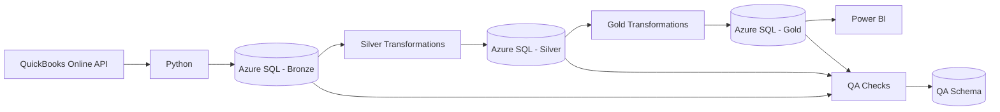

# Sample FP&A Analytics Pipeline

End-to-end FP&A analytics portfolio project that extracts accounting data from **QuickBooks Online**, processes it through a **Bronze / Silver / Gold** data architecture in **Azure SQL**, applies automated **data quality checks**, and prepares curated datasets for consumption in **Power BI**.

> This project uses synthetic business data and a QuickBooks Online sandbox environment. No real company or customer data is included.

## Architecture



The pipeline is currently orchestrated locally through Python/Jupyter notebooks, keeping the project lightweight while still demonstrating production-style analytics engineering patterns.

## Business Scenario

CloudFlow Systems, Inc. is a fictional B2B SaaS company used to simulate a realistic FP&A environment.

The accounting history covers **September 2023 through August 2026** and supports analysis such as revenue and expense trends, monthly P&L reporting, Actual performance by account, budget and forecast integration, SaaS metrics, and headcount analysis.

The current version focuses on the accounting Actuals pipeline.

## Tech Stack

- **QuickBooks Online API** — accounting source system
- **Python** — extraction, transformation, orchestration, and QA
- **Pandas** — data transformation
- **SQLAlchemy + pyodbc** — Azure SQL connectivity
- **Azure SQL Database** — cloud data storage
- **Jupyter / VS Code** — development and pipeline execution
- **Power BI** — semantic modeling and reporting

## Data Architecture

### Bronze

Raw API responses are stored with minimal transformation.

```text
bronze.qbo_accounts_raw
bronze.qbo_customers_raw
bronze.qbo_journal_entries_raw
```

Each record includes source entity ID, batch ID, extraction timestamp, and the original JSON payload.

### Silver

The Silver layer converts raw JSON payloads into structured analytical tables.

```text
silver.dim_account
silver.dim_customer
silver.fact_gl
```

Key transformations include parsing QuickBooks JSON, standardizing data types, creating signed debit/credit amounts, adding time attributes, and filtering sandbox sample transactions.

### Gold

The Gold layer contains datasets designed for BI consumption.

```text
gold.pnl_monthly_actual
```

The current P&L table aggregates Actuals by year, month, account, account type, account subtype, and accounting classification.

Revenue and expense signs are normalized for reporting.

## Data Quality

Pipeline checks are stored in:

```text
qa.pipeline_checks
```

Current checks include:

- Bronze datasets are not empty
- Required Silver fields are not null
- Journal line IDs are unique
- Journal entries are balanced
- Expected number of CloudFlow journals
- Expected number of reporting months
- Gold output is not empty

Critical failures can stop the pipeline before downstream consumption.

## Project Structure

```text
cloudflow-fpa/
│
├── notebooks/
│   ├── 00_setup_and_connections.ipynb
│   ├── 01_extract_quickbooks_bronze.ipynb
│   ├── 02_transform_silver.ipynb
│   ├── 03_build_gold.ipynb
│   ├── 04_qa_checks.ipynb
│   └── 99_run_pipeline.ipynb
│
├── src/
│   ├── __init__.py
│   ├── config.py
│   ├── quickbooks.py
│   ├── azure_sql.py
│   ├── transformations.py
│   └── qa.py
│
├── tokens/
│   └── qbo_tokens.json
│
├── .env
├── .gitignore
└── README.md
```

The `src/` directory contains reusable application logic, while notebooks are used to execute and document each pipeline stage.

## Pipeline Execution

Individual notebooks can be used during development:

```text
00 → Validate environment and connections
01 → Extract QuickBooks data to Bronze
02 → Transform Bronze to Silver
03 → Build Gold reporting tables
04 → Run and persist QA checks
```

For a full refresh, run:

```text
99_run_pipeline.ipynb
```

## Local Setup

Create and activate a virtual environment:

```powershell
python -m venv .venv
.\.venv\Scripts\Activate.ps1
```

Install the required packages:

```powershell
pip install pandas requests python-dotenv sqlalchemy pyodbc jupyter ipykernel
```

Microsoft **ODBC Driver 18 for SQL Server** must also be installed locally.

Create a `.env` file in the project root:

```env
QBO_CLIENT_ID=your_client_id
QBO_CLIENT_SECRET=your_client_secret
QBO_REALM_ID=your_realm_id

AZURE_SQL_SERVER=your_server.database.windows.net
AZURE_SQL_DATABASE=your_database
AZURE_SQL_USERNAME=your_username
AZURE_SQL_PASSWORD=your_password
```

Create:

```text
tokens/qbo_tokens.json
```

with:

```json
{
  "refresh_token": "your_refresh_token"
}
```

The QuickBooks refresh token is rotated automatically by the pipeline.

## Security

Secrets are intentionally excluded from version control.

The repository `.gitignore` should include:

```gitignore
.env
tokens/
.venv/
__pycache__/
*.pyc
.ipynb_checkpoints/
.vscode/
```

Never commit QuickBooks credentials, refresh tokens, or Azure SQL passwords.

## Current Status

Completed:

- QuickBooks OAuth integration
- QuickBooks API extraction
- Azure SQL connectivity
- Bronze raw ingestion
- Silver accounting model
- Gold monthly P&L Actuals
- Automated QA framework
- End-to-end pipeline notebook